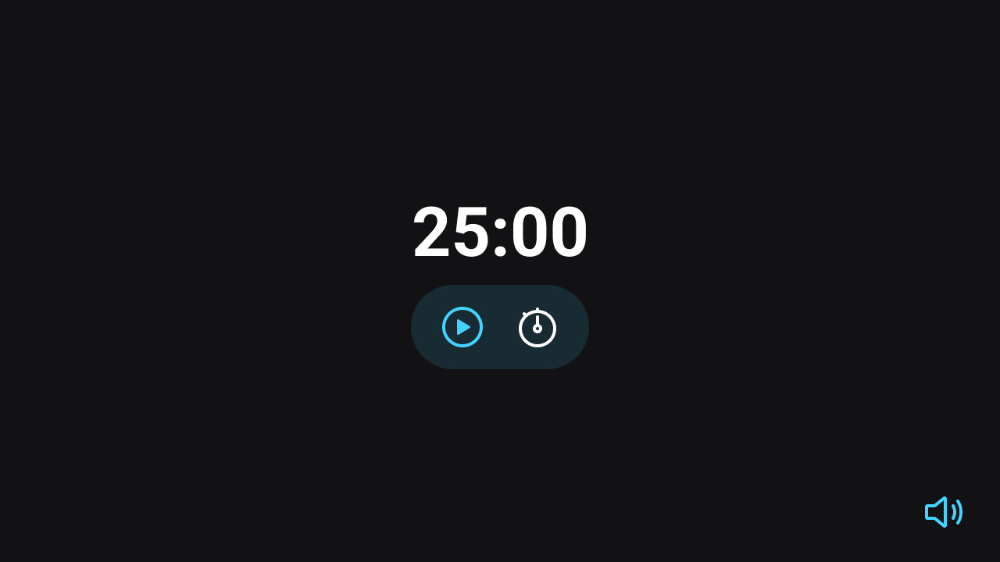

<h1 align="center"> Focus Timer </h1>

Repositório do desafio Focus Timer do stage 05 da turma 09 do explorer, o objetivo era criar uma página com um contador regressivo.  

  <a href="#technologies">Technologies</a>&nbsp;&nbsp;&nbsp;|&nbsp;&nbsp;&nbsp;
  <a href="#project">Project</a>&nbsp;&nbsp;&nbsp;|&nbsp;&nbsp;&nbsp;
  <a href="#layout">Layout</a>

 

  

## 🚀 Technologies

Esse projeto foi desenvolvido com as seguintes tecnologias:

- HTML e CSS
- JavaScript
- Git e Github
- Figma

## 💻 Project

O projeto consiste em uma página com um contador regressivo onde o usuário deverá informar o tempo inicial do contador e quando a contagem for encerrada, um alerta sonoro é disparado para informar ao usuário que o tempo chegou a 00:00. O usuário poderá optar por ouvir, ou não, um som agradável durante a contagem, além das funcionalidades de play, pause e stop.

- [Visite o projeto online]()

## 🔖 Layout

Você pode visualizar o layout do projeto através [DESSE LINK](https://www.figma.com/file/jrp8xKSeooL8uwmXPUPrBI/Explorer-Stage-05-Projeto-01/duplicate). É necessário ter conta no [Figma](https://figma.com) para acessá-lo.

---

Made with 💜 by raulrodmo

